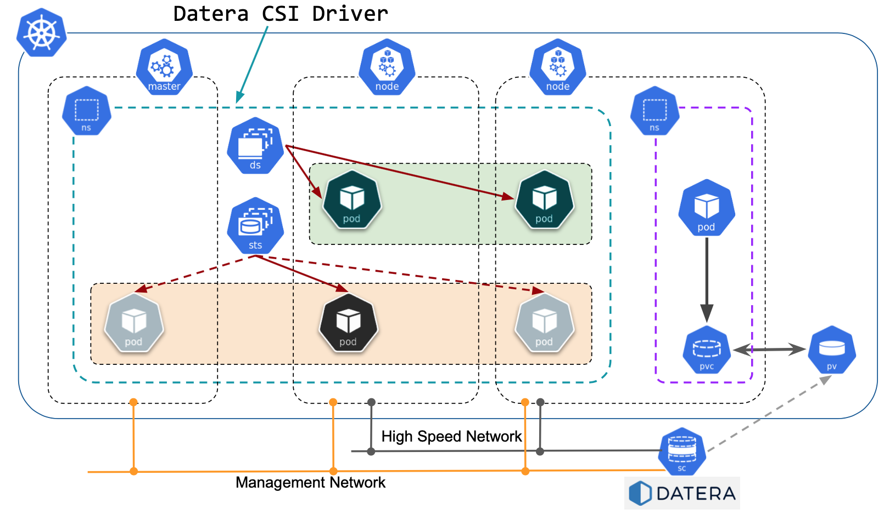

# Datera CSI Volume Plugin

- [ 1. Overview ](#overview)
- [ 2. Supported versions ](#supported-versions)
- [ 3. Driver Installation ](#driver-installation)
  * [ 3.1. Prerequisites ](#prerequisites) 
  * [ 3.2. Update install YAML ](#update-install-yaml)
  * [ 3.3. Optional Secrets ](#optional-secrets)
  * [ 3.4. Install Datera CSI driver ](#install-datera-csi-driver)
- [ 4. Performing Volume operations ](#performing-volume-operations)
  * [ 4.1. Create StorageClass ](#create-storageclass)
  * [ 4.2. Create a Volume ](#create-a-volume)
  * [ 4.3. Create an Application using the Volume](#create-an-application-using-the-volume)
  * [ 4.4. Creating and using Volume Snapshots ](#creating-and-using-volume-snapshots)
- [ 5. Collecting Logs ](#collecting-logs)
- [ 6. Odd Case Environment Variables ](#odd-case-environment-variables)
- [ 7. Note on K8S setup through Rancher ](#note-on-k8s-setup-through-rancher)
- [ 8. Driver upgrades and downgrades ](#driver-upgrades-and-downgrades)
  
  

## Overview

Datera is a fully disaggregated scale-out storage platform, that runs over multiple standard protocols (iSCSI, Object/S3), combining both heterogeneous compute platform/framework flexibility (HPE, Dell, Fujitsu, Cisco and others) with rapid deployment velocity and access to data from anywhere. Datera® is a software-defined data infrastructure for virtualized environments, databases, cloudstacks, DevOps, microservices and container deployments. It provides operations-free delivery and orchestration of data at scale for any application within a traditional datacenter, private cloud or hybrid cloud setting.
 
Datera gives Kubernetes (K8s) enterprise customers the peace of mind of a future-proof data services platform that is ready for diverse and demanding workloads -- as K8s continues to dominate the container orchestration arena, it is likely to containerize higher-end workloads, as well.

The Datera CSI Volume Plugin uses Datera storage backend as distributed data storage for containers.



## Supported Versions

| Datera CSI Plugin Version | Supported CSI Versions | Supported Kubernetes Versions |
| --- | --- | --- |
| v1.0.4 | v1.0 | v1.13.X+ |
| v1.0.5 | v1.0 | v1.13.X+ |
| v1.0.6 | v1.0 | v1.13.X+ |
| v1.0.7 | v1.0 | v1.13.X+ |
| v1.0.8 | v1.0 | v1.13.X+ |
| v1.0.9 | v1.0 | v1.13.X+ |
| v1.0.10 | v1.0 | v1.13.X+ |

## Driver Installation

### Prerequisites

Kubernetes Installation/Configuration (Kubernetes v1.13+ required). Note that container-based ISCSID is no longer supported. The Datera implementation runs an iscsi-send inside the driver containers and an iscsi-recv on the kubernetes hosts. The iscsi-recv would further use the iscsid on the kubernetes hosts for performing iSCSI operations. 

Ensure iscsid and iscsi-recv are running on the hosts. <b>These MUST be performed before installing the CSI plugin</b>:

First install iscsid on the kubernetes hosts

Ubuntu
```bash
$ apt install open-iscsi
```

Centos
```bash
$ yum install iscsi-initiator-utils
```

Verify iscsid is running:
```bash
$ ps -ef | grep iscsid
root     12494   996  0 09:41 pts/2    00:00:00 grep --color=auto iscsid
root     13326     1  0 Dec17 ?        00:00:01 /sbin/iscsid
root     13327     1  0 Dec17 ?        00:00:05 /sbin/iscsid
```

Clone the datera-csi repository
```bash
$ git clone http://github.com/Datera/datera-csi
```

Run the iscsi-recv service installer
```bash
$ ./assets/setup_iscsi.sh
[INFO] Dependency checking
[INFO] Downloading iscsi-recv
[INFO] Verifying checksum
[INFO] Changing file permissions
[INFO] Registering iscsi-recv service
Created symlink from /etc/systemd/system/multi-user.target.wants/iscsi-recv.service to /lib/systemd/system/iscsi-recv.service.
[INFO] Starting iscsi-recv service
[INFO] Verifying service started correctly
root      4879     1  0 19:50 ?        00:00:00 /var/datera/iscsi-recv -addr unix:////var/datera/csi-iscsi.sock
```

Check that the iscsi-recv service is running
```bash
$ systemctl --all | grep iscsi-recv
iscsi-recv.service       loaded    active     running   iscsi-recv container to host iscsiadm adapter service
```

### Update install YAML

Modify deploy/kubernetes/releases/1.0/csi-datera-v1.0.x.yaml and update the
values for the following environment variables in the yaml:

* `DAT_MGMT`   -- The management IP of the Datera system
* `DAT_USER`   -- The username of your Datera account
* `DAT_PASS`   -- The password for your Datera account
* `DAT_TENANT` -- The tenant to use with your Datera account
* `DAT_API`    -- The API version to use when communicating (should be 2.2,
                currently the only version the plugin supports)

There are 2 locations for each value within the yaml that should be modified. One is under the StatefulSet and the other is under the DaemonSet. Note that the yaml does not come with a built-in StorageClass. Create one using the following example shown and modifying it depending on deployment needs.

### Optional Secrets

Instead of putting the username/password in the yaml file directly instead you can use the kubernetes secrets capabilities.

NOTE: This must be done before installing the CSI driver.

First create the secrets.  They're base64 encoded strings.  The two required secrets are "username" and "password". Modify and save the below yaml as secrets.yaml.

```yaml
apiVersion: v1
kind: Secret
metadata:
  name: datera-secret
  namespace: kube-system
type: Opaque
data:
  # base64 encoded username
  # generate this via "$ echo -n 'your-username' | base64"
  username: YWRtaW4=
  # base64 encoded password
  # generate this via "$ echo -n 'your-password' | base64"
  password: cGFzc3dvcmQ=
```

Then create the secrets.

```bash
$ kubectl create -f secrets.yaml
```

Now install the CSI driver like above, but using the "secrets" yaml:

```bash
$ kubectl create -f csi-datera-secrets-v1.0.4.yaml
```

The only difference between the "secrets" yaml and the regular yaml is the
use of secrets for the "username" and "password" fields.

### Install Datera CSI driver

```bash
$ kubectl create -f csi-datera-v1.0.x.yaml
```
For example:

```bash
# kubectl create -f csi-datera-secrets-1.0.9.yaml
storageclass.storage.k8s.io/dat-block-storage created
serviceaccount/csi-datera-controller-sa created
clusterrole.rbac.authorization.k8s.io/csi-datera-provisioner-role created
clusterrolebinding.rbac.authorization.k8s.io/csi-datera-provisioner-binding created
clusterrole.rbac.authorization.k8s.io/csi-datera-attacher-role created
clusterrolebinding.rbac.authorization.k8s.io/csi-datera-attacher-binding created
clusterrole.rbac.authorization.k8s.io/csi-datera-snapshotter-role created
clusterrolebinding.rbac.authorization.k8s.io/csi-datera-snapshotter-binding created
statefulset.apps/csi-provisioner created
serviceaccount/csi-datera-node-sa created
clusterrole.rbac.authorization.k8s.io/csi-datera-node-driver-registrar-role created
clusterrolebinding.rbac.authorization.k8s.io/csi-datera-node-driver-registrar-binding created
daemonset.apps/csi-node created
#
```

You should see one csi-provisioner pod and 'N' csi-node pods running in kube-system namespace, where N = number of kubernetes worker nodes. The csi-provisioner pod can run on any kubernetes node.

```bash
# kubectl get pods -n kube-system -o wide | egrep 'NAME|csi-'
NAME                                       READY   STATUS    RESTARTS   AGE     IP           NODE    NOMINATED NODE   READINESS GATES
csi-node-cwpfk                             3/3     Running   0          164m    1.1.1.1      node1   <none>           <none>
csi-node-lx66c                             3/3     Running   0          164m    2.2.2.2      node2   <none>           <none>
csi-provisioner-0                          6/6     Running   0          163m    1.1.1.1      node1   <none>           <none>
[root@tlx51cp tmp]# 
```

## Performing Volume operations

### Create StorageClass

Before creating a Volume, a StorageClass needs to be created. This StorageClass acts like a template where you can specify your Volume and QoS parameters. The parameters can be placed within the ``parameters`` section of the StorageClass.

In the following example we configure volumes with a replica of 3 and a QoS of 1000 IOPS max.  All parameters must be strings (pure numbers and booleans should be enclosed in quotes). Save the following as 'csi-storageclass.yaml' file.

```yaml
kind: StorageClass
apiVersion: storage.k8s.io/v1
metadata:
  name: dat-block-storage
  namespace: kube-system
  annotations:
    storageclass.kubernetes.io/is-default-class: "true"
provisioner: io.datera.csi.dsp
parameters:
  replica_count: "3"
  total_iops_max "1000"
```

Here are a list of supported parameters for the plugin:

Name                   |     Default
----------------       |     ------------
``replica_count``      |     ``3``
``placement_mode``     |     ``hybrid``
``ip_pool``            |     ``default``
``template``           |     ``""``
``round_robin``        |     ``false``
``read_iops_max``      |     ``0``
``write_iops_max``     |     ``0``
``total_iops_max``     |     ``0``
``read_bandwidth_max`` |     ``0``
``write_bandwidth_max``|     ``0``
``total_bandwidth_max``|     ``0``
``iops_per_gb``        |     ``0``
``bandwidth_per_gb``   |     ``0``
``fs_type``            |     ``ext4`` (Currently the only supported values are 'ext4' and 'xfs')
``fs_args``            |     ``-E lazy_itable_init=0,lazy_journal_init=0,nodiscard -F``
``delete_on_unmount``  |     ``false``

NOTE: All parameters MUST be strings in the yaml file otherwise the kubectl parser will fail.  If in doubt, enclose each in double quotes ("")

```bash
$ kubectl create -f csi-storageclass.yaml
```

### Create a Volume

A volume on Datera backend is created automatically when a Persistent Volume Claim (PVC) is created. This PVC can be further referenced in a Pod manifest to use the volume. 

```yaml
apiVersion: v1
kind: PersistentVolumeClaim
metadata:
  name: csi-pvc
  namespace: default
spec:
  accessModes:
  - ReadWriteOnce
  resources:
    requests:
      storage: 100Gi
  storageClassName: dat-block-storage
```

```bash
$ kubectl create -f csi-pvc.yaml
```

### Create an Application using the Volume

Create and save the following as csi-app.yaml. Note that this Pod claims a volume by specifying the name of a PVC claim "csi-pvc".

```yaml
kind: Pod
apiVersion: v1
metadata:
  name: my-csi-app
spec:
  containers:
    - name: my-app-image
      image: alpine
      volumeMounts:
      - mountPath: "/data"
        name: my-app-volume
      command: [ "sleep", "1000000" ]
  volumes:
    - name: my-app-volume
      persistentVolumeClaim:
        claimName: csi-pvc
```

```bash
$ kubectl create -f csi-app.yaml
```

### Creating and using Volume Snapshots

To create a volume snapshot in kubernetes you can use the following VolumeSnapshotClass and VolumeSnapshot as an example. Save the following as csi-snap-class.yaml.

```yaml
apiVersion: snapshot.storage.k8s.io/v1alpha1
kind: VolumeSnapshotClass
metadata:
  name: dat-snap-class
snapshotter: dsp.csi.daterainc.io
parameters:
```

Here are a list of supported snapshot parameters for the plugin:
(v1.0.7+)

Name                        |     Default
------------------------    |     ------------
``remote_provider_uuid``    |     ``""``
``type``                    |     ``local`` options: local, remote, local\_and\_remote

Example VolumeSnapshotClass yaml file with parameters:

```yaml
apiVersion: snapshot.storage.k8s.io/v1alpha1
kind: VolumeSnapshotClass
metadata:
  name: dat-snap-class
snapshotter: dsp.csi.daterainc.io
parameters:
  remote_provider: c7f97223-81d9-44fe-ae7b-7c27daf6c288
  type: local_and_remote
```

```bash
$ kubectl create -f csi-snap-class.yaml
```

Create and save the following as csi-snap.yaml.

```yaml
apiVersion: snapshot.storage.k8s.io/v1alpha1
kind: VolumeSnapshot
metadata:
  name: csi-snap
spec:
  snapshotClassName: dat-snap-class
  source:
    name: csi-pvc
    kind: PersistentVolumeClaim
```

```bash
$ kubectl create -f snap.yaml
```

We can now view the snapshot using kubectl command.

```bash
$ kubectl get volumesnapshots
NAME       AGE
csi-snap   2m
```

Now we can use this snapshot to create a new PVC.

```yaml
apiVersion: v1
kind: PersistentVolumeClaim
metadata:
  name: csi-restore-from-snapshot
spec:
  storageClassName: dat-block-storage
  dataSource:
    name: csi-snap
    kind: VolumeSnapshot
    apiGroup: snapshot.storage.k8s.io
  accessModes:
    - ReadWriteOnce
  resources:
    requests:
      storage: 100Gi
```

## Collecting Logs

You can collect logs from the entire Datera CSI plugin via the ``csi_log_collect.sh`` script in the ``datera-csi/assets`` folder. Basic log collection is very simple.  Run the script with no arguments on the Kubernetes master node.

```bash
$ chmod +x ./assets/csi_log_collect.sh
$ ./assets/csi_log_collect.sh
```

## Odd Case Environment Variables

Sometimes customer setups require a bit of flexibility.  These environment variables allow for tuning the plugin to behave in atypical ways.  USE THESE WITH CAUTION.

* DAT\_SOCKET               -- Socket that driver listens on
* DAT\_HEARTBEAT            -- Interval to perform Datera heartbeat function
* DAT\_TYPE                 -- Which CSI services to expose on the binary
* DAT\_VOL\_PER\_NODE       -- Max volumes per node setting
* DAT\_DISABLE\_MULTIPATH   -- Disable multipath (for use with bonded nics)
* DAT\_REPLICA\_OVERRIDE    -- Override set replica counts to 1 (for single-node systems)
* DAT\_METADATA\_DEBUG      -- Calculates metadata size before sending (for checking 2KB hard-limit)
* DAT\_DISABLE\_LOGPUSH     -- Disables pushing plugin logs to the Datera system
* DAT\_LOGPUSH\_INTERVAL    -- Sets interval between logpushes to the Datera system
* DAT\_FORMAT\_TIMEOUT      -- Sets the timeout duration for volume format calls (default 60 seconds)

## Note on K8S setup through Rancher

In Rancher setup, the kubelet is run inside a container and hence may not have access to the socket /var/datera/csi-iscsi.sock on the host. Run '# nc -U /var/datera/csi-iscsi.sock' from inside the kubelet container and verify whether the socket is listening. If not, a bind mount would be needed as specified here: https://docs.docker.com/storage/bind-mounts/

```bash
  --mount type=bind,source="/var/datera/csi-iscsi.sock"/target,target=/var/datera/csi-iscsi.sock
```

## Driver upgrades and downgrades

Driver upgrades and downgrades can be done by running a 'kubectl delete -f <csi_driver_yaml_used_to_create>' followed by 'kubectl delete -f <csi_driver_yaml_for_new_version>'. For example, a downgrade from v1.0.9 to v1.0.8 can be done as follows:

```bash
# kubectl delete -f csi-datera-1.0.9.yaml
# kubectl create -f csi-datera-1.0.8.yaml
```

